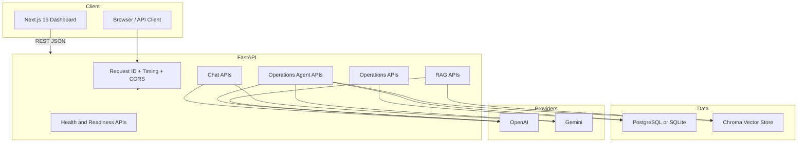
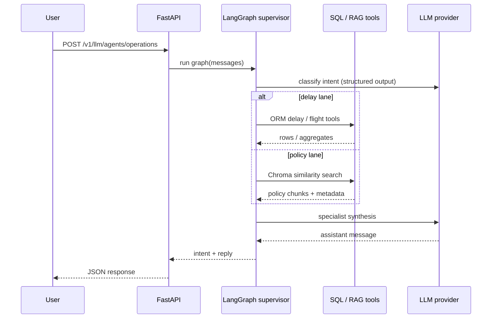

<!-- Hero: recruiter / portfolio centerpiece -->
# Agentic Flight Operations Intelligence _(AFOIS)_

     

**Enterprise-style AI SaaS demo** — **LangGraph** operations agents, **Chroma RAG** over airline policy corpus, **read-only flight/delay SQL tools**, **OpenAI ⇄ Gemini** with **automatic chat failover**, **graceful quota UX**, and a **premium Next.js 15 dashboard** (`web/`) with same-origin **`/afois-api`** proxy, **Sonner** toasts, **Recharts** ops analytics, and **collapsible sidebar** navigation.

> **Python:** **3.11+** (Dockerfile / CI). **Node:** **18+** for `web/` (CI uses Node 22). Local 3.9 may run but 3.11 is the supported path.

---

## Why this repo exists (recruiter / internship lens)

| Theme | What you can say in interviews |
|--------|--------------------------------|
| **Agents** | Supervisor classifies **delay vs policy vs general**, then runs **LangGraph** subgraphs with **ReAct** + tools. |
| **Grounding** | Delay answers use **parameterized SQLAlchemy tools** (no string-concat SQL). Policy answers use **vector retrieval** + cited excerpts. |
| **RAG** | Chunked ingestion from `policy_documents`, **Chroma** persistence, **similarity search with distance**, stable chunk IDs. |
| **LLM platform** | **Provider abstraction**: OpenAI (`openai`) + **Gemini** (`google-generativeai` for `/v1/llm/chat`, `langchain-google-genai` for agents). |
| **Production habits** | **JSON structured logs**, **request IDs**, **dual-LLM chat failover**, **latency fields** on `/v1/llm/chat`, **readiness probe**, **retries**, **quota fallback** copy. |

---

## Architecture



---

## End-to-end workflow



---

## AI pipeline (how reasoning is grounded)

### LangGraph supervisor

1. **Router node** — LLM returns structured `RoutedIntent` (`delay` | `policy` | `general`). On provider glitches, intent falls back to `general` (logged).
2. **Delay specialist** — `create_react_agent` with **read-only** tools: delayed flights, delay events, aggregates, station touches (validated IATA).
3. **Policy specialist** — ReAct agent with **Chroma-backed** `search_station_policies`.
4. **General specialist** — Direct LLM answer with OCC tone.

Execution emits structured logs: `intent_classified`, `ops_graph_completed`.

### RAG pipeline

1. **Source** — `policy_documents` rows from SQL.
2. **Chunking** — `RecursiveCharacterTextSplitter` (hierarchical separators, `start_index`, overlap) via `split_documents`.
3. **Attribution** — Metadata: `doc_code`, `section_ref`, `source_attribution`, `chunk_index`, `start_index`, `policy_id`.
4. **De-duplication** — Stable **Chroma IDs** from chunk fingerprints (same logical chunk → same id on re-ingest when IDs align).
5. **Retrieval** — `similarity_search_with_score`: response includes **L2 distance** (lower = closer for default Chroma distance).

---

## Screenshots & demo media

Capture your deployed or local UI and drop files under **`docs/screenshots/`** (`overview.png`, `chat.png`, `rag.png`, `agents.png`). For motion, attach a short **screen recording GIF** — links render well on LinkedIn/GitHub READMEs once files are checked in.

---

## Repository layout

| Path | Role |
|------|------|
| `src/afos/api/` | FastAPI app, routes, exception hooks |
| `src/afos/agents/` | LangGraph graph, prompts, tools |
| `src/afos/llm/` | Provider-agnostic chat + LangChain model factory |
| `src/afos/rag/` | Embeddings, Chroma, ingestion |
| `src/afos/db/` | SQLAlchemy models & session |
| `src/afos/core/` | Settings, logging, warnings, startup validation |
| `alembic/` | Migrations |
| `scripts/` | Seed data, Chroma sync |
| `docker/` | Container entrypoint (migrate → serve) |
| `web/` | **Next.js 15** production UI (App Router, Tailwind v4, shadcn/ui, React Query, Framer Motion) |

---

## Web dashboard (Next.js)

The **`web/`** app is a recruiter-ready **airline operations control** experience wired to the existing APIs (no backend rewrite).

### UI feature map

| Area | Routes | Backend |
|------|--------|---------|
| **Overview** | `/` | `GET /v1/ops/flights`, `GET /v1/ops/ready` — KPI cards, alerts, status chart, board table |
| **Operations** | `/ops` | Same flights API with optional `airline_code` filter |
| **AI chat** | `/chat` | `POST /v1/llm/chat` and `POST /v1/llm/agents/operations` — tabs, markdown, typing-style reveal, local history |
| **Ops agent** | `/agents` | Agent-only chat + **intent / model** insight panel, prompt starters |
| **Policy RAG** | `/rag` | `GET /v1/rag/search` — citations, metadata, L2 distance, relevance labels |

Stack: **TypeScript**, **Tailwind CSS**, **shadcn/ui** (Base UI), **TanStack React Query** (retries, caching, skeletons), **Framer Motion**, **next-themes** (dark-first). Shared **`src/lib/api-client.ts`** adds fetch retries.

### How the browser talks to the API (important)

**Required pattern:** The browser **only** calls same-origin **`/afois-api/...`**. Next.js **rewrites** that (server-side) to **`AFOIS_BACKEND_URL`** (alias **`BACKEND_URL`**) — default **`http://127.0.0.1:8000`**. Do **not** set **`NEXT_PUBLIC_API_URL`** in your shell or `.env.local`; it used to bypass the proxy and triggers **Failed to fetch** / flaky CORS. The client code ignores it entirely now.

### Frontend setup

```bash
cd agentic-flight-ops-intel/web
cp .env.example .env.local
# Defaults work with Uvicorn on 127.0.0.1:8000. Override AFOIS_BACKEND_URL if needed.

npm install
npm run dev
# http://localhost:3000
```

Production build (`next build` bakes rewrites using the **`AFOIS_BACKEND_URL`** / env available at build time; set it in CI or your image build for non-default API hosts):

```bash
npm run build && npm start
```

**Docker (full stack):** `docker compose up --build` starts **Postgres**, **API :8000**, and **Next :3000** (`web` service proxies to `http://api:8000`). Open **http://localhost:3000**.

### Screenshots (portfolio)

Capture your own runs and drop files under `docs/screenshots/` (suggested names):

| Suggested file | Content |
|----------------|---------|
| `docs/screenshots/web-overview.png` | `/` — glass KPI cards + flight board |
| `docs/screenshots/web-chat.png` | `/chat` — assistant / ops agent tabs |
| `docs/screenshots/web-rag.png` | `/rag` — policy hits with scores |
| `docs/screenshots/web-agents.png` | `/agents` — reasoning + intent |

The repo ships the UI only; images are optional so forks stay lightweight.

---

## Quick start (local SQLite)

```bash
cd agentic-flight-ops-intel
python3.11 -m venv .venv
source .venv/bin/activate
pip install -r requirements.txt

export PYTHONPATH=src
mkdir -p data
cp .env.example .env
# Edit .env: OPENAI_API_KEY and/or GEMINI_API_KEY, LLM_PROVIDER

DATABASE_URL=sqlite:///./data/afois_local.db alembic upgrade head
DATABASE_URL=sqlite:///./data/afois_local.db python scripts/seed_sample_data.py
DATABASE_URL=sqlite:///./data/afois_local.db python scripts/sync_chroma_policies.py

DATABASE_URL=sqlite:///./data/afois_local.db uvicorn afos.api.app:app --reload --host 0.0.0.0 --port 8000
```

**Full stack (optional):** in a second terminal, run **`cd web && npm run dev`** (see **Web dashboard** — default uses **`/afois-api`** proxy; no extra env required if the API is on port 8000).

**macOS LibreSSL / urllib3 noise:** optional clean test output:

```bash
pytest -q -W "ignore::urllib3.exceptions.NotOpenSSLWarning"
```

---

## Operations & probes

| Endpoint | Purpose |
|----------|---------|
| `GET /health` | Liveness — process up, version, time |
| `GET /v1/ops/ready` | Readiness — DB `SELECT 1`, LLM key present flag |
| `GET /v1/ops/llm-config` | Non-secret LLM config snapshot |
| `GET /v1/ops/db-health` | DB scalar check |
| `GET /v1/llm/version` | Package version + active provider/model |

Responses include **`X-Request-Id`** and **`X-Process-Time-Ms`**.

---

## Key API examples (`curl`)

**Health & readiness**

```bash
curl -s http://localhost:8000/health | jq
curl -s http://localhost:8000/v1/ops/ready | jq
```

**Flights (relational)**

```bash
curl -s "http://localhost:8000/v1/ops/flights?airline_code=UA&limit=5" | jq
```

**RAG debug search** (returns snippets + **distance**)

```bash
curl -s "http://localhost:8000/v1/rag/search?q=minimum%20connection%20international&k=4" | jq
```

**Stateless chat** (OpenAI or Gemini per `.env`)

```bash
curl -s http://localhost:8000/v1/llm/chat \
  -H "Content-Type: application/json" \
  -d '{"messages":[{"role":"user","content":"Give a one-sentence OCC weather brief."}],"temperature":0.2}' | jq
```

**LangGraph operations agent**

```bash
curl -s http://localhost:8000/v1/llm/agents/operations \
  -H "Content-Type: application/json" \
  -d '{"messages":[{"role":"user","content":"Summarize delay attributions; highlight crew-related cases."}]}' | jq
```

**Admin corpus rebuild** (requires `ADMIN_REINDEX_TOKEN` + header)

```bash
curl -s -X POST http://localhost:8000/v1/rag/rebuild \
  -H "X-Admin-Token: $ADMIN_REINDEX_TOKEN" | jq
```

OpenAPI UI: [http://localhost:8000/docs](http://localhost:8000/docs)

---

## Environment reference

| Variable | Purpose |
|----------|---------|
| `DATABASE_URL` | SQLAlchemy URL (SQLite dev / Postgres prod) |
| `LLM_PROVIDER` | **`openai`** (recommended reliability) \| `gemini` \| `auto` (OpenAI-first if OpenAI key present) |
| `OPENAI_API_KEY` / `OPENAI_MODEL` | OpenAI chat + optional embeddings |
| `GEMINI_API_KEY` / `GEMINI_MODEL` | Native Gemini |
| `GEMINI_FALLBACK_MODEL` | Optional backup model on quota (chat path) |
| `EMBEDDING_PROVIDER` | `auto` \| `openai` \| `local` |
| `ADMIN_REINDEX_TOKEN` | Protects `POST /v1/rag/rebuild` |
| `LLM_RATE_LIMIT_FALLBACK_REPLY` | Optional soft message (HTTP 200) on hard rate limits |
| `CORS_ALLOWED_ORIGINS` | Comma-separated browser origins for the Next.js (or other) UI |
| `CORS_ALLOW_LOCALHOST_REGEX` | If `true`, allow any `localhost` / `127.0.0.1` port (dev convenience; set `false` in strict prod) |
| `LLM_AUTO_FAILOVER` | `true`: `/v1/llm/chat` tries the alternate provider once after primary **rate-limit** exhaustion |
| `LLM_RATE_LIMIT_FALLBACK_REPLY` | Optional graceful **HTTP 200** demo copy when all providers quota out |
| `LANGSMITH_*` | Optional tracing |

See `.env.example` for the full list.

---

## Deployment _(Render · Railway · Docker VPS · AWS-sketch)_

**Full guide:** [docs/DEPLOYMENT.md](docs/DEPLOYMENT.md)

Short version:

- **Render:** use [`render.yaml`](render.yaml) Blueprint; set synced secrets (`DATABASE_URL`, API keys); disk mount **`/var/data`** for Chroma.
- **Railway:** “Deploy from Dockerfile” → set same env vars; optional volume for **`CHROMA_PERSIST_DIRECTORY`**.
- **Docker VPS:** build this `Dockerfile`, bind disk for **`CHROMA_PERSIST_DIRECTORY`**, run `entrypoint.sh` (migrations → Uvicorn); put **Caddy/nginx** TLS in front; host **`web`** separately (`npm run build` + **`AFOIS_BACKEND_URL`** to public API).

See [.env.example](.env.example) and [web/.env.example](web/.env.example) for splits between API and frontend env.

---

## Docker Compose (Postgres parity)

```bash
export OPENAI_API_KEY=sk-...   # and/or GEMINI_API_KEY
export ADMIN_REINDEX_TOKEN=change-me-in-prod
docker compose up --build
```

Then seed and index:

```bash
docker compose exec api python scripts/seed_sample_data.py
docker compose exec api python scripts/sync_chroma_policies.py
```

- **Web UI:** `http://localhost:3000` (Next dev server; proxies `/afois-api` → `api` service)
- **API:** `http://localhost:8000`
- **Postgres:** `localhost:5432` (see `docker-compose.yml`)
- **Chroma:** named volume at `/data/chroma_db` in container

---

## Render deployment

**Option A — Blueprint (fastest):** In the Render dashboard choose **New** → **Blueprint**, connect this repo, and point to [`render.yaml`](render.yaml). Then set **sync: false** secrets in the UI: `DATABASE_URL`, `OPENAI_API_KEY` and/or `GEMINI_API_KEY`, and copy the generated `ADMIN_REINDEX_TOKEN` for rebuilds. The blueprint provisions a **1 GB disk** at `/var/data` with `CHROMA_PERSIST_DIRECTORY=/var/data/chroma_db`.

**Option B — Manual Web Service:**

1. **New Web Service** → connect repo → **Dockerfile** build.
2. **Plan:** set `DATABASE_URL` to Render Postgres (or external RDS).
3. **Disk:** attach persistent disk; set `CHROMA_PERSIST_DIRECTORY` to mount path (e.g. `/var/data/chroma_db`).
4. **Env:** copy from `.env.example`; set secrets in the dashboard (never commit).
5. **Health check path:** `/health` (liveness) or `/v1/ops/ready` (readiness if DB attached).
6. **Start command:** default `entrypoint.sh` runs `alembic upgrade head` then Uvicorn.
7. Post-deploy: open **Shell** on the service and run `python scripts/seed_sample_data.py` and `python scripts/sync_chroma_policies.py` once.

---

## AWS (high level)

- **Compute:** ECS Fargate or EKS using this `Dockerfile`.
- **Data:** RDS PostgreSQL; **Chroma** on **EFS** or migrate to managed vector (Pinecone / OpenSearch) later.
- **Secrets:** Secrets Manager / SSM for keys and `ADMIN_REINDEX_TOKEN`.
- **LB:** Target group health check → `/health` or `/v1/ops/ready`.
- **Logs:** CloudWatch Logs subscription; structured JSON logs map cleanly to metric filters.

---

## Recruiter demo walkthrough (UI + API)

**Local (two terminals):** (1) Start API: `DATABASE_URL=... uvicorn afos.api.app:app --reload --host 0.0.0.0 --port 8000` with `PYTHONPATH=src`. (2) Start UI: `cd web && npm run dev`. Open **http://localhost:3000** — the green **Backend connected** banner should appear (uses **`/afois-api`** proxy by default).

**Docker:** `docker compose up --build`, then seed/sync (see **Docker Compose**). Open **http://localhost:3000** for the dashboard and **http://localhost:8000/docs** for OpenAPI.

**Script (after seed + Chroma sync):**

1. **Overview** (`/`) — KPI cards and flight board from `/v1/ops/flights`.
2. **AI chat** (`/chat`) — try **Assistant** and **Ops agent** tabs; use **Demo prompts** below.
3. **Policy RAG** (`/rag`) — search “minimum connection international”; cite distances + metadata.
4. **Ops agent** (`/agents`) — watch **intent** badge after a delay or policy question.

Capture screenshots under `docs/screenshots/` (see **Web dashboard**).

**Example prompts (paste into chat / agent):**

- “List flights marked delayed and explain crew-related attribution from delay events.”
- “What flights touch ORD in the demo database?”
- “What does policy say about minimum connection times for international itineraries?”
- “Summarize re-accommodation principles from policy excerpts.”
- “Hi — quick question about vouchers for long delays” (exercises **policy** routing).

---

## Testing & CI

```bash
export PYTHONPATH=src
export DATABASE_URL=sqlite:///:memory:
pytest -q
```

GitHub Actions (`.github/workflows/ci.yml`): **Ruff** + **pytest** (Python 3.11) + **Next.js `npm run build`** in `web/`.

---

## Troubleshooting

| Symptom | Likely cause | Fix |
|---------|----------------|-----|
| `503` on `/v1/llm/*` | No API key matching **`LLM_PROVIDER`** | With **`LLM_PROVIDER=openai`**, **`OPENAI_API_KEY` must be set** (Gemini key alone won’t activate chat/agents until you switch provider or keys) |
| `429` from Gemini/OpenAI | Quota / rate limits | Retry later; set `GEMINI_FALLBACK_MODEL`; use `LLM_RATE_LIMIT_FALLBACK_REPLY` |
| Empty RAG hits | Chroma empty | Run `scripts/sync_chroma_policies.py` or `POST /v1/rag/rebuild` |
| `403` on rebuild | Admin token | Set `ADMIN_REINDEX_TOKEN` + `X-Admin-Token` header |
| SQLite locked | Multiple writers | Use Postgres via Docker for concurrency |
| Browser blocked API calls | Bypassing proxy | The app always uses **`/afois-api`**; unset **`NEXT_PUBLIC_API_URL`** in your terminal profile if exported |
| UI “API unreachable” | API not running or wrong proxy target | Start Uvicorn on **8000**; set **`AFOIS_BACKEND_URL`** if the API is not on `127.0.0.1:8000`; click **Retry** on the banner |
| `uvicorn` “Address already in use” on **8000** | **Docker Compose** `api` service holds the port | Either keep using that API (`docker compose up`) or run `docker compose stop api` before local Uvicorn |
| Chat / agent **429** in UI | Provider quota | Set **`LLM_RATE_LIMIT_FALLBACK_REPLY`** in `.env` and pass it into Compose (see `docker-compose.yml`); recreate the `api` container |
| Deprecation warnings | Upstream SDKs | Warnings filtered at startup where safe; upgrade Python to 3.11+ |

---

## Security

See [SECURITY.md](SECURITY.md). Never commit real `.env` files or keys.

---

## Resume-ready bullets (copy/paste)

- Built a **LangGraph** supervisor with **structured intent routing** and **ReAct** specialists (**SQL tools** + **Chroma RAG**).
- Implemented **provider-agnostic LLM** layer: **OpenAI** and **native Gemini** (`google-generativeai` + **LangChain Google GenAI** for agents).
- Shipped **FastAPI** APIs for **health/readiness**, **ops reads**, **chat**, **agents**, and **secured RAG rebuild**; **structured JSON logging** with **request correlation**; **CORS** for a **Next.js 15** ops dashboard in `web/`.
- Delivered **Alembic** migrations, **Docker Compose**, **Chroma** persistence with **chunk fingerprint IDs** and **scored retrieval**, and **CI** (Ruff + pytest).

---

## License

Proprietary — replace if you open-source a personal demo fork.
